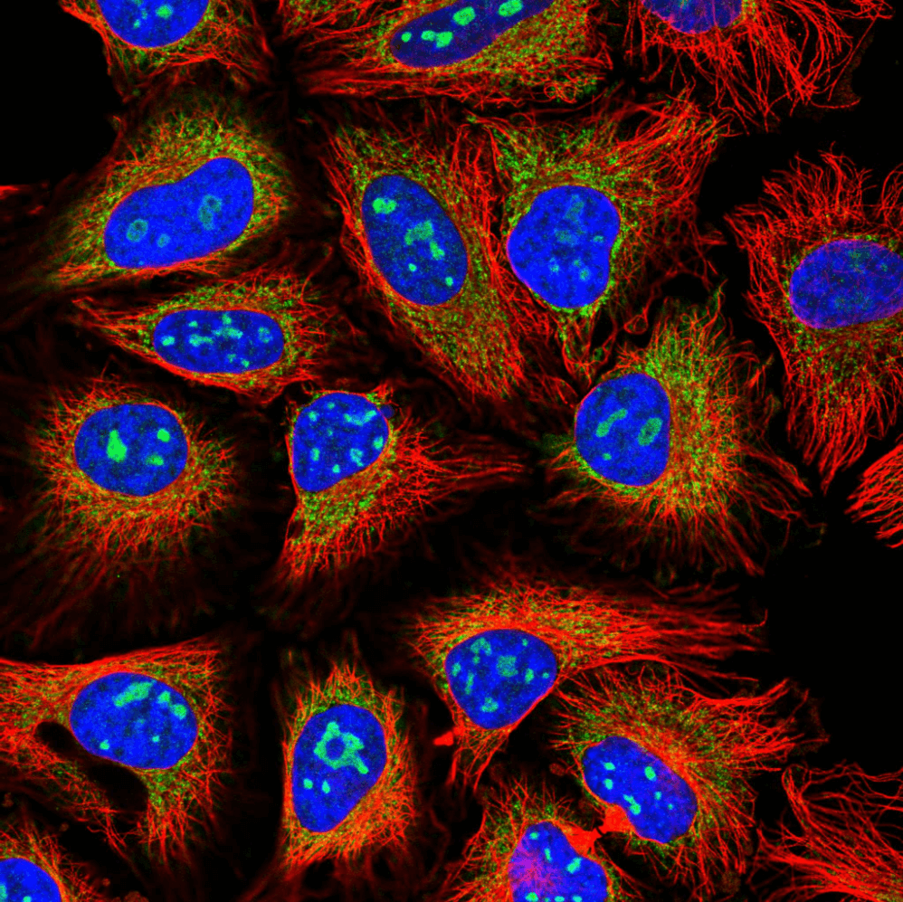

# Protein_atlas_public
A public repository of Human Protein Atlas Classification competition

## Description from Kaggle
In this competition, Kagglers will develop models capable of classifying mixed patterns of proteins in microscope images. The Human Protein Atlas will use these models to build a tool integrated with their smart-microscopy system to identify a protein's location(s) from a high-throughput image.

Proteins are “the doers” in the human cell, executing many functions that together enable life. Historically, classification of proteins has been limited to single patterns in one or a few cell types, but in order to fully understand the complexity of the human cell, models must classify mixed patterns across a range of different human cells.

Images visualizing proteins in cells are commonly used for biomedical research, and these cells could hold the key for the next breakthrough in medicine. However, thanks to advances in high-throughput microscopy, these images are generated at a far greater pace than what can be manually evaluated. Therefore, the need is greater than ever for automating biomedical image analysis to accelerate the understanding of human cells and disease.

## What contestants are predicting
You are predicting protein organelle localization labels for each sample. There are in total 28 different labels present in the dataset. The dataset is acquired in a highly standardized way using one imaging modality (confocal microscopy). However, the dataset comprises 27 different cell types of highly different morphology, which affect the protein patterns of the different organelles. All image samples are represented by four filters (stored as individual files), the protein of interest (green) plus three cellular landmarks: nucleus (blue), microtubules (red), endoplasmic reticulum (yellow). The green filter should hence be used to predict the label, and the other filters are used as references.

The labels are represented as integers that map to the following:

>0.  Nucleoplasm  
>1.  Nuclear membrane   
>2.  Nucleoli   
>3.  Nucleoli fibrillar center   
>4.  Nuclear speckles   
>5.  Nuclear bodies   
>6.  Endoplasmic reticulum   
>7.  Golgi apparatus   
>8.  Peroxisomes   
>9.  Endosomes   
>10.  Lysosomes   
>11.  Intermediate filaments   
>12.  Actin filaments   
>13.  Focal adhesion sites   
>14.  Microtubules   
>15.  Microtubule ends   
>16.  Cytokinetic bridge   
>17.  Mitotic spindle   
>18.  Microtubule organizing center   
>19.  Centrosome   
>20.  Lipid droplets   
>21.  Plasma membrane   
>22.  Cell junctions   
>23.  Mitochondria   
>24.  Aggresome   
>25.  Cytosol   
>26.  Cytoplasmic bodies   
>27.  Rods & rings  
